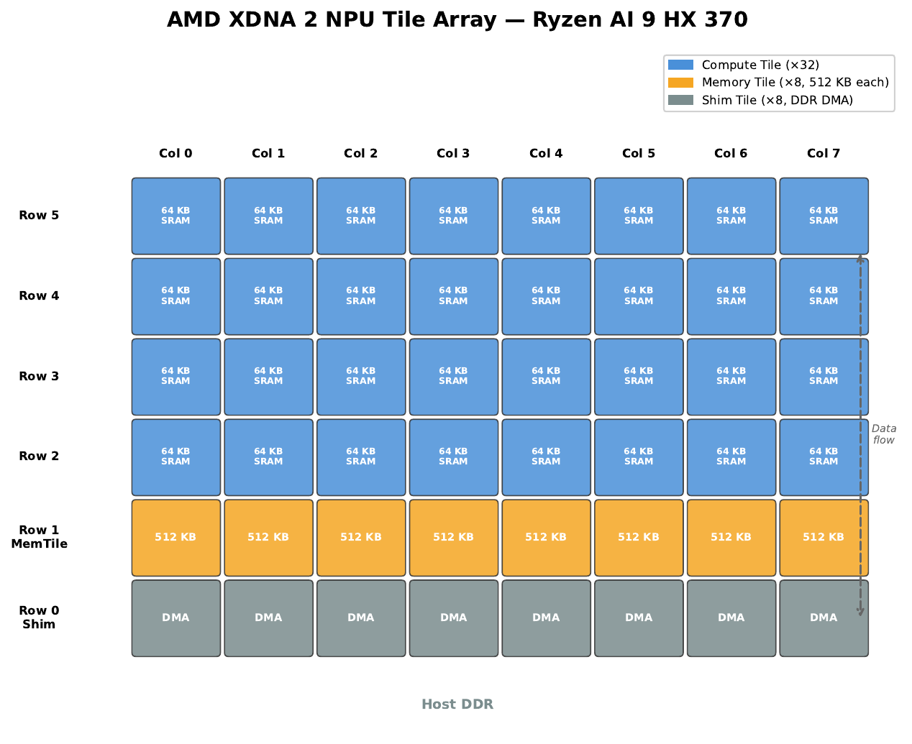

# TileFlow: Neural Networks Co-Designed with NPU Hardware

TileFlow is a hardware-software co-design project on the AMD Ryzen AI NPU
(XDNA 2 / Strix Point). It uses the [IRON/MLIR-AIE](https://github.com/amd/IRON)
toolchain to program the NPU at the individual tile level — designing a neural
network whose architecture maps **exactly** to the NPU's physical tile array.

**The idea**: instead of compiling an arbitrary neural network to the NPU,
design the network to match the hardware from the start. Each block of layers
corresponds to one NPU pipeline call; what the CPU does between calls
(normalisation, input injection, residual connections) is what the model does
between blocks during training.

## Current Demo: Character-Level Language Model

A 32-layer recurrent character LM trained on tiny Shakespeare:

| Model | Params | Val Loss | Perplexity | Device |
|-------|--------|----------|------------|--------|
| **TileFlow block-RNN** | 542K | 2.42 | 11.2 | NPU (32 tiles) |
| Transformer baseline | 818K | 1.89 | 6.6 | GPU |

The block-RNN is weaker than a transformer of similar size, but it runs
entirely on the NPU with the trained weights producing identical computation
on hardware — no approximations, no graph compilation, no operator fallback.

### NPU Performance

| Metric | Value |
|--------|-------|
| NPU tiles used | 32 (8 columns × 4 rows) |
| NPU calls per character | 8 (one per 4-layer block) |
| Latency per NPU call | 0.14 ms |
| Latency per character | 4.2 ms (NPU + CPU overhead) |
| Throughput (1 sequence) | 233 chars/s |
| Throughput (384 parallel) | **89,600 chars/s** |

### Quick Start

```bash
# Train on GPU (~18 min for 10 epochs)
HSA_OVERRIDE_GFX_VERSION=11.0.0 python -m char_lm.train --epochs 10

# Generate text on CPU
python -m char_lm.generate --device cpu --prompt "KING RICHARD"

# Generate text on NPU (32 tiles, 384 parallel sequences)
python -m char_lm.generate --device npu --prompt "KING RICHARD"
```

## Architecture

The model processes each character through 8 blocks of 4 layers:

```
for each character:
    for each block g = 0..7:
        CPU:  h_b = RMSNorm(h) + embed(char) + bias_g
        NPU:  h_b = ReLU(ReLU(ReLU(ReLU(h_b @ W[4g]) @ W[4g+1]) @ W[4g+2]) @ W[4g+3])
        CPU:  h = h + h_b   (residual connection)
    CPU:  h = RMSNorm(h)
    CPU:  logits = h @ W_out + b_out
```

Each NPU call runs one block through the 4-stage pipeline on all 32 tiles:

```
 Column 0        Column 1        ...  Column 7
 (batch 0-47)    (batch 48-95)        (batch 336-383)
┌───────────┐   ┌───────────┐        ┌───────────┐
│ Row 2: W₀ │   │ Row 2: W₀ │   ...  │ Row 2: W₀ │  Stage 1: ReLU(h_b @ W₀)
│ MatMul+ReLU│   │ MatMul+ReLU│        │ MatMul+ReLU│
├─────↓─────┤   ├─────↓─────┤        ├─────↓─────┤
│ Row 3: W₁ │   │ Row 3: W₁ │   ...  │ Row 3: W₁ │  Stage 2: ReLU(· @ W₁)
│ MatMul+ReLU│   │ MatMul+ReLU│        │ MatMul+ReLU│
├─────↓─────┤   ├─────↓─────┤        ├─────↓─────┤
│ Row 4: W₂ │   │ Row 4: W₂ │   ...  │ Row 4: W₂ │  Stage 3: ReLU(· @ W₂)
│ MatMul+ReLU│   │ MatMul+ReLU│        │ MatMul+ReLU│
├─────↓─────┤   ├─────↓─────┤        ├─────↓─────┤
│ Row 5: W₃ │   │ Row 5: W₃ │   ...  │ Row 5: W₃ │  Stage 4: ReLU(· @ W₃)
│  (output)  │   │  (output)  │        │  (output)  │
└───────────┘   └───────────┘        └───────────┘
```

- **8 columns** process 8 batch slices in parallel (48 samples each = 384 total)
- **4 rows** form a 4-stage pipeline (one weight matrix per tile)
- **Hidden dim** = 128 (weight 32 KB + 2×12 KB activations = 56 KB fits 64 KB SRAM)
- Data flows tile-to-tile via ObjectFIFOs — no DDR traffic within a block

## The Hardware

The XDNA 2 NPU in the Ryzen AI 9 HX 370:



| Property | Value |
|---|---|
| Compute tiles | 32 (8 columns × 4 rows, rows 2–5) |
| Memory tiles | 8 (row 1, 512 KB each, 4 MB total) |
| Shim tiles | 8 (row 0, DMA interface to host DDR) |
| Per-tile SRAM | ~64 KB data memory |
| Per-tile compute | bf16 MMUL unit (VLIW+SIMD) |
| Peak throughput | **25 TFLOPS** (bfloat16) |
| Power | ~6 W |

## Project Structure

```
npu-spatial-nets/
├── char_lm/
│   ├── model.py               # Block-recurrent char LM (RecurrentCharLM)
│   ├── train.py               # GPU training loop (ROCm / CUDA)
│   ├── generate.py            # Text generation on CPU or NPU
│   ├── transformer_baseline.py # GPT-style reference model for comparison
│   └── data.py                # Shakespeare dataset and vocabulary
├── spatial_mlp/
│   ├── __init__.py            # Tiling utilities (to_tiled, from_tiled)
│   ├── pipeline_design.py     # IRON design: 32-tile pipeline (8 cols × 4 rows)
│   ├── pipeline_op.py         # IRON operator: compilation + runtime buffers
│   └── pipeline_test.py       # NPU benchmark: latency, TFLOPS, correctness
├── aie_kernels/
│   ├── matmul_relu.cc         # Fused C = ReLU(A × B) kernel
│   └── mlp_kernels.cc         # Support kernels: copy_bf16
├── docs/
│   ├── tileflow_whitepaper.pdf
│   ├── generate_whitepaper.py
│   ├── generate_figures.py
│   └── *.png                  # Architecture diagrams
├── data/
│   ├── shakespeare.txt        # Training data (1.1 MB)
│   └── charlm_checkpoint.pt   # Trained model checkpoint
└── README.md
```

## Design Principles

1. **Hardware dictates architecture**: The NPU has 32 tiles in a 4×8 grid.
   The model has 32 layers in 8 blocks of 4. This is not a coincidence.

2. **No approximation at inference**: The model trains with exactly the same
   block structure that runs on the NPU. CPU handles norm/embed/bias between
   blocks; NPU handles the 4-layer matmul+ReLU chain within blocks.

3. **Amortise overhead**: Each NPU call takes ~0.14 ms (mostly XRT driver
   overhead, not compute). With 8 calls per character, that's 1.1 ms of NPU
   time. The 384 parallel sequences amortise this to 89K chars/s.

## Historical Benchmarks

Earlier phases of this project explored different NPU mappings:

| Phase | Architecture | Tiles | NPU TFLOPS | Peak % | CPU Speedup |
|-------|-------------|-------|-----------|--------|-------------|
| 1. GEMM | Single large matmul | 32 | 2.49 | 10% | 1.4× |
| 2. Pipeline MLP | 4-stage feedforward | 32 | 0.13 | 0.5% | 0.87× |
| 3. Recurrent MLP | Same-W hardware loop | 24 | **23.93** | **95.7%** | **26×** |
| 4. Char LM | Block-recurrent pipeline | 32 | — | — | — |

**Key insight**: The NPU achieves near-peak throughput when data stays on-chip
for many iterations (Phase 3). The current block-recurrent model trades peak
TFLOPS utilisation for a richer architecture (32 distinct weight matrices,
normalisation, residual connections) — compute per NPU call is small
(4 matmuls at H=128), but the model is actually useful.

## Toolchain

| Component | Role |
|---|---|
| [IRON](https://github.com/amd/IRON) | Python API for tile layout + dataflow |
| [MLIR-AIE](https://github.com/Xilinx/mlir-aie) | MLIR dialect → hardware compilation |
| [Peano/LLVM-AIE](https://github.com/Xilinx/llvm-aie) | C++ compiler for per-tile kernels |
| [XRT](https://github.com/amd/xdna-driver) | Runtime for loading/executing on NPU |

## Hardware Requirements

- **Processor**: AMD Ryzen AI 9 HX 370 (or any XDNA 2 / Strix Point APU)
- **OS**: Linux, kernel 6.11+ with `amdxdna` driver
- **NPU device**: `/dev/accel/accel0` must be accessible
- **GPU (training)**: AMD iGPU with ROCm, or NVIDIA with CUDA

## References

- [IRON repo](https://github.com/amd/IRON) — close-to-metal NPU programming
- [MLIR-AIE programming guide](https://github.com/Xilinx/mlir-aie/tree/main/programming_guide)
- [NPU training (arXiv)](https://arxiv.org/html/2504.03083v1) — backprop on AIE tiles
- [Linux kernel NPU docs](https://docs.kernel.org/accel/amdxdna/amdnpu.html)
